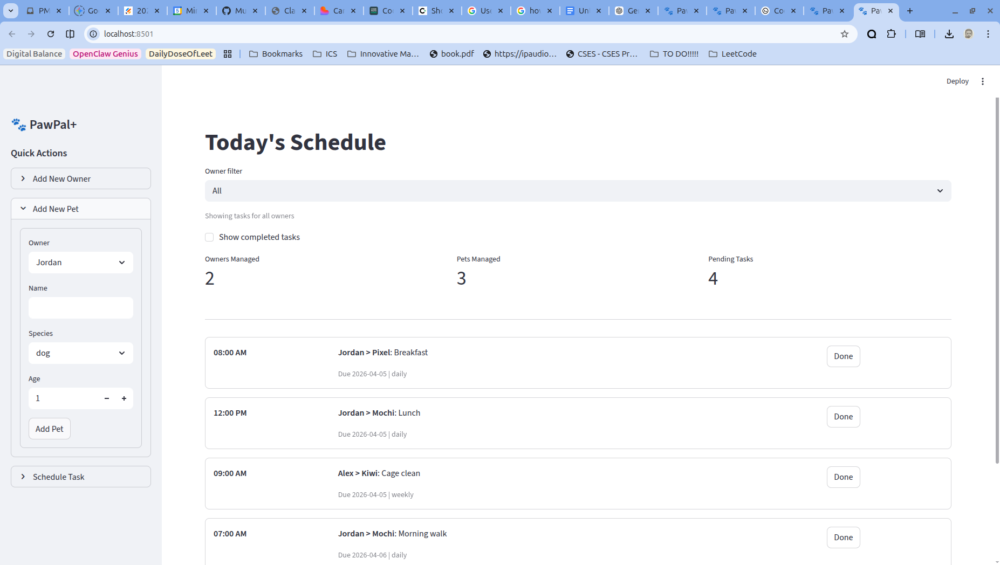

# PawPal+ (Module 2 Project)

You are building **PawPal+**, a Streamlit app that helps a pet owner plan care tasks for their pet.

## Scenario

A busy pet owner needs help staying consistent with pet care. They want an assistant that can:

- Track pet care tasks (walks, feeding, meds, enrichment, grooming, etc.)
- Consider constraints (time available, priority, owner preferences)
- Produce a daily plan and explain why it chose that plan

Your job is to design the system first (UML), then implement the logic in Python, then connect it to the Streamlit UI.

## What you will build

Your final app should:

- Let a user enter basic owner + pet info
- Let a user add/edit tasks (duration + priority at minimum)
- Generate a daily schedule/plan based on constraints and priorities
- Display the plan clearly (and ideally explain the reasoning)
- Include tests for the most important scheduling behaviors

## Getting started

## Smarter Scheduling

Recent scheduling upgrades include:

- Sorting tasks by due date and time for a cleaner daily plan
- Filtering tasks by pet and completion status
- Filtering the dashboard by a selected owner or across all owners
- Auto-creating the next occurrence for recurring tasks (daily/weekly/monthly)
- Lightweight conflict warnings for tasks that share the same scheduled slot

## Features

- Chronological scheduling with multi-key sorting (due date first, then HH:MM time)
- Robust time ordering that safely pushes invalid time strings to the end instead of crashing
- Flexible task filtering by pet name (case-insensitive) and completion status
- Owner dashboard filter with per-owner and `All` household views for tasks, metrics, and conflict warnings
- Organized planning view using deterministic ordering by completion state, due date, recurrence frequency rank, and time
- Recurrence engine that auto-generates the next task instance when daily, weekly, or monthly items are completed
- Completion workflow that updates status in place using pet name, description, exact time, and exact due date to target the correct recurring instance
- Conflict detection algorithm that groups tasks by exact (date, time) slots and returns warning messages for duplicate slots
- Cross-pet task aggregation through Owner and Scheduler to support whole-household planning views

### Setup

```bash
python -m venv .venv
source .venv/bin/activate  # Windows: .venv\Scripts\activate
pip install -r requirements.txt
```

### Suggested workflow

1. Read the scenario carefully and identify requirements and edge cases.
2. Draft a UML diagram (classes, attributes, methods, relationships).
3. Convert UML into Python class stubs (no logic yet).
4. Implement scheduling logic in small increments.
5. Add tests to verify key behaviors.
6. Connect your logic to the Streamlit UI in `app.py`.
7. Refine UML so it matches what you actually built.

## Testing PawPal+

Run the full test suite from the project root:

```bash
python -m pytest
```

Current automated tests cover the core scheduler behaviors, including:

- Marking tasks complete and updating completion status
- Adding tasks to pets and validating task-list growth
- Chronological sorting by due date and time
- Invalid-time fallback ordering for safe chronological sorting
- Filtering tasks by pet name and completion state
- Daily recurrence creation when a recurring task is completed
- Exact-date completion matching for recurring tasks
- Duplicate time-slot conflict detection with warning messages
- Deterministic organize-task ordering and cross-pet aggregation

Confidence Level: 4/5 stars

Rationale: The current suite passes and validates the most important scheduling paths, especially sorting, recurrence, and conflict warnings. Reliability is high for implemented core logic, with room to improve confidence further by adding more edge-case and UI integration tests.

## 📸 Demo

Run the Streamlit app locally with:

```bash
streamlit run app.py
```

Current app demo:


