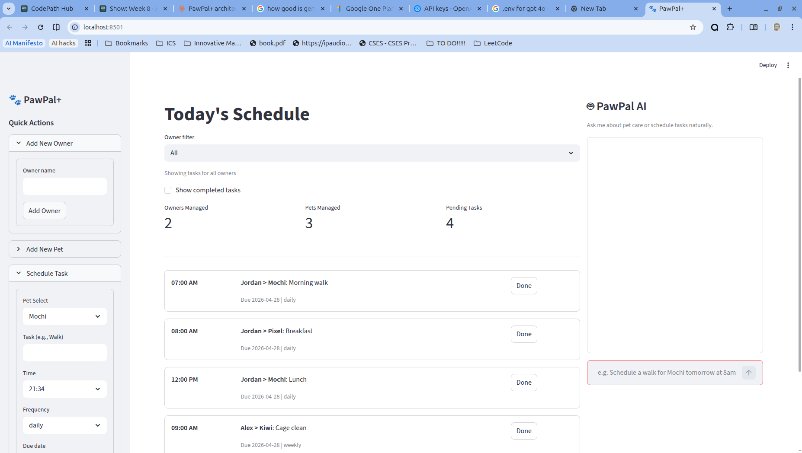

# PawPal+ AI: Intelligent Pet-Care Assistant

| Video Walkthrough | Current App Frontend |
| :--- | :--- |
| [https://www.loom.com/share/f3b5b5c971304bd8bdff330d8e2d24d7]() |  |

## About The Original Project (Modules 1-3)
The original project, **PawPal+**, was a Streamlit app designed to help a pet owner plan care tasks for their pet. It allowed users to track tasks (walks, feeding, meds, grooming) and produced a daily schedule based on constraints and priorities using a legacy backend scheduler.

## What it does now (Final AI System)
PawPal+ has been upgraded into a fully autonomous, conversational AI assistant using GPT-4o. It integrates an agentic workflow that can read, write, and manage your pet's schedule directly from the chat interface. Furthermore, it incorporates a Retrieval-Augmented Generation (RAG) system using ChromaDB to ground its advice in actual pet-care medical documentation, ensuring safe, reliable, and actionable scheduling.

Your final app should:

- Let a user enter basic owner + pet info
- Let a user add/edit tasks (duration + priority at minimum)
- Generate a daily schedule/plan based on constraints and priorities
- Display the plan clearly (and ideally explain the reasoning)
- Include tests for the most important scheduling behaviors

## Getting started

## Smarter Scheduling

Recent scheduling upgrades include:

- Sorting tasks by due date and time for a cleaner daily plan
- Filtering tasks by pet and completion status
- Filtering the dashboard by a selected owner or across all owners
- Auto-creating the next occurrence for recurring tasks (daily/weekly/monthly)
- Lightweight conflict warnings for tasks that share the same scheduled slot

## Features

- Chronological scheduling with multi-key sorting (due date first, then HH:MM time)
- Robust time ordering that safely pushes invalid time strings to the end instead of crashing
- Flexible task filtering by pet name (case-insensitive) and completion status
- Owner dashboard filter with per-owner and `All` household views for tasks, metrics, and conflict warnings
- Organized planning view using deterministic ordering by completion state, due date, recurrence frequency rank, and time
- Recurrence engine that auto-generates the next task instance when daily, weekly, or monthly items are completed
- Completion workflow that updates status in place using pet name, description, exact time, and exact due date to target the correct recurring instance
- Conflict detection algorithm that groups tasks by exact (date, time) slots and returns warning messages for duplicate slots
- Cross-pet task aggregation through Owner and Scheduler to support whole-household planning views

### AI-Powered Features

- **RAG Knowledge Base**: 6 pet-care markdown files (vaccination, nutrition, exercise, grooming, medication, enrichment) embedded via ChromaDB for grounded AI responses
- **GPT-4o Agent**: Agentic AI assistant with three tools — `get_schedule`, `add_task`, `flag_conflict_or_gap` — that reads and writes the live dashboard state
- **Natural Language Scheduling**: Users can type requests like "Schedule a flea treatment for Mochi tomorrow at 9am" and the agent handles the rest
- **Confidence Scoring**: Every AI response includes a 1-5 confidence score displayed in the chat UI
- **Structured Logging**: Every agent invocation, tool call, and result is logged to `pawpal.log` with timestamps
- **Conflict Awareness**: The agent automatically checks for scheduling conflicts after adding tasks

## AI Architecture

The AI system has three layers:

1. **Knowledge Base (RAG)** — Markdown files in `knowledge/` are chunked and embedded into ChromaDB. User queries retrieve the top-3 relevant chunks as context for the agent.
2. **AI Agent (Agentic)** — A GPT-4o agent with function calling. It receives the user message + RAG chunks + schedule snapshot, decides which tools to call, executes them against session state, and responds.
3. **Chat UI** — A Streamlit chat panel alongside the dashboard. The agent's task modifications are reflected in real time.

### Setup

```bash
python -m venv .venv
source .venv/bin/activate  # Windows: .venv\Scripts\activate
pip install -r requirements.txt
```

**API Key**: Create `.streamlit/secrets.toml` with your OpenAI key:
```toml
OPENAI_API_KEY = "sk-..."
```

### Suggested workflow

1. Read the scenario carefully and identify requirements and edge cases.
2. Draft a UML diagram (classes, attributes, methods, relationships).
3. Convert UML into Python class stubs (no logic yet).
4. Implement scheduling logic in small increments.
5. Add tests to verify key behaviors.
6. Connect your logic to the Streamlit UI in `app.py`.
7. Refine UML so it matches what you actually built.

## Testing PawPal+

Run the full test suite from the project root:

```bash
python -m pytest
```

Current automated tests cover the core scheduler behaviors, including:

- Marking tasks complete and updating completion status
- Adding tasks to pets and validating task-list growth
- Chronological sorting by due date and time
- Invalid-time fallback ordering for safe chronological sorting
- Filtering tasks by pet name and completion state
- Daily recurrence creation when a recurring task is completed
- Exact-date completion matching for recurring tasks
- Duplicate time-slot conflict detection with warning messages
- Deterministic organize-task ordering and cross-pet aggregation

AI agent and knowledge base tests (deterministic, no API calls):

- get_schedule tool reads correct tasks, filters by owner and date range
- add_task tool creates tasks in session state with validation
- add_task detects conflicts after creation
- Graceful error handling for unknown owners and pets
- flag_conflict_or_gap appends warnings correctly
- Knowledge base loads and chunks all markdown files
- RAG queries return relevant chunks with correct result counts
- Edge cases: empty queries, empty directories

Total: 29 tests (9 scheduler + 12 agent + 8 knowledge base) — all passing.

Confidence Level: 4/5 stars

Rationale: The current suite passes and validates the most important scheduling paths, especially sorting, recurrence, and conflict warnings. The AI agent tools are tested deterministically without API calls. Reliability is high for implemented core logic, with room to improve confidence further by adding more edge-case and end-to-end integration tests.

## 📸 Demo

Run the Streamlit app locally with:

```bash
streamlit run app.py
```
