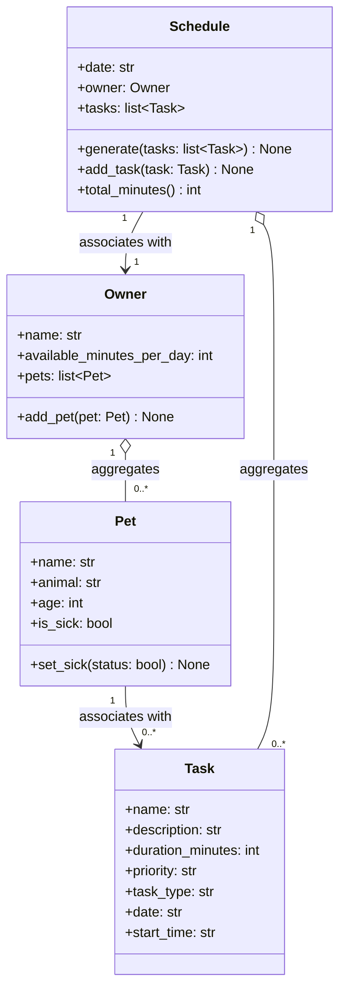

# PawPal+ UML Class Diagram

```mermaid
classDiagram
    class Owner {
        +name: str
        +available_minutes_per_day: int
        +pets: list~Pet~
        +add_pet(pet: Pet) None
    }

    class Pet {
        +name: str
        +animal: str
        +age: int
        +is_sick: bool
        +set_sick(status: bool) None
    }

    class Task {
        +name: str
        +description: str
        +duration_minutes: int
        +priority: str
        +task_type: str
        +date: str
        +start_time: str
    }

    class Schedule {
        +date: str
        +owner: Owner
        +tasks: list~Task~
        +generate(tasks: list~Task~) None
        +add_task(task: Task) None
        +total_minutes() int
    }

    Owner "1" o-- "0..*" Pet : aggregates
    Schedule "1" --> "1" Owner : associates with
    Pet "1" --> "0..*" Task : associates with
    Schedule "1" o-- "0..*" Task : aggregates
```
