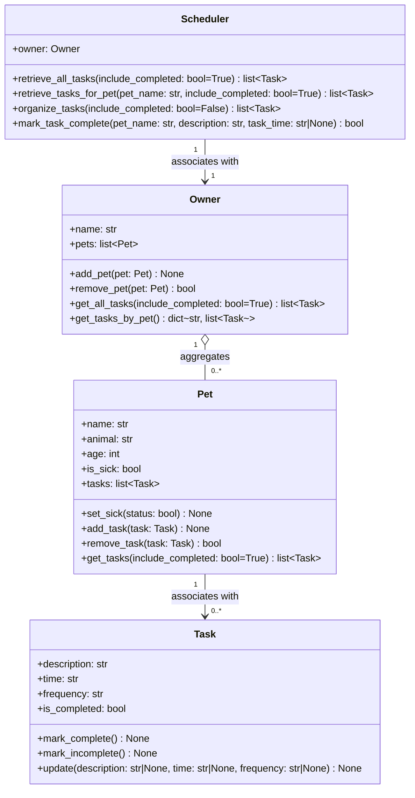

# PawPal+ UML Class Diagram

```mermaid
classDiagram
    class Owner {
        +name: str
        +pets: list~Pet~
        +add_pet(pet: Pet) None
        +remove_pet(pet: Pet) bool
        +get_all_tasks(include_completed: bool=True) list~Task~
        +get_tasks_by_pet() dict~str, list~Task~~
    }

    class Pet {
        +name: str
        +animal: str
        +age: int
        +is_sick: bool
        +tasks: list~Task~
        +set_sick(status: bool) None
        +add_task(task: Task) None
        +remove_task(task: Task) bool
        +get_tasks(include_completed: bool=True) list~Task~
    }

    class Task {
        +description: str
        +time: str
        +frequency: str
        +is_completed: bool
        +mark_complete() None
        +mark_incomplete() None
        +update(description: str|None, time: str|None, frequency: str|None) None
    }

    class Scheduler {
        +owner: Owner
        +retrieve_all_tasks(include_completed: bool=True) list~Task~
        +retrieve_tasks_for_pet(pet_name: str, include_completed: bool=True) list~Task~
        +organize_tasks(include_completed: bool=False) list~Task~
        +mark_task_complete(pet_name: str, description: str, task_time: str|None) bool
    }

    Owner "1" o-- "0..*" Pet : aggregates
    Pet "1" --> "0..*" Task : associates with
    Scheduler "1" --> "1" Owner : associates with
```
